# Onboarding Guide

This guide is for a generalist programmer who wants to become useful in Deplodock without first becoming a GPU compiler
specialist. The fastest way in is to understand the product loops, learn where responsibilities live, and then make one
small change in the layer you are touching.

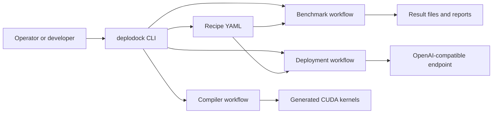

## What Deplodock Is

Deplodock has three overlapping jobs:

- **Compile** PyTorch or HuggingFace model code into Deplodock graph IR, lower it through scheduling stages, and emit CUDA.
- **Benchmark** recipes across GPU types, model configs, engines, and concurrency settings.
- **Deploy** recipes locally, over SSH, or on cloud VMs using Docker Compose and vLLM or SGLang.

Think of the repo as a CLI shell around reusable libraries. The CLI files parse arguments and choose a workflow; the
top-level packages do the real work.

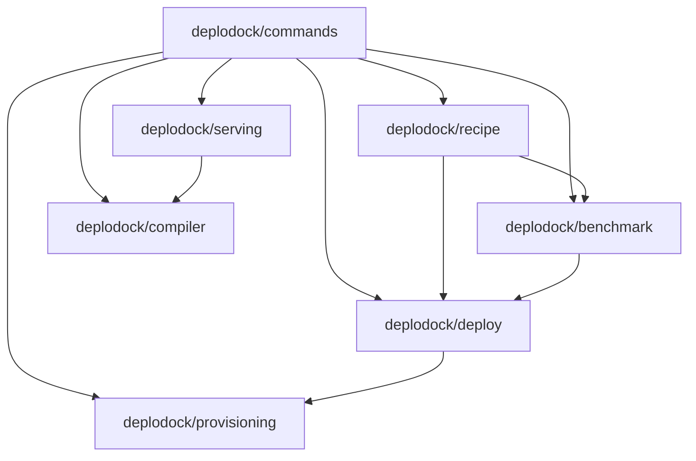

## First Day Setup

Use Python 3.12 or newer. The default development install includes the compiler, tests, formatting tools, plotting
dependencies, and Playwright.

```bash
git clone https://github.com/cloudrift-ai/deplodock.git
cd deplodock
make setup
```

Useful local checks:

```bash
make lint
make test
./venv/bin/deplodock --help
```

For serving integration work, install the serving extra because vLLM is intentionally optional:

```bash
./venv/bin/pip install -e ".[compile,serving]"
```

For local or remote inference deployments you also need Docker, Docker Compose, and usually `HF_TOKEN` for HuggingFace
downloads. Cloud workflows additionally need provider credentials such as `CLOUDRIFT_API_KEY` or GCP configuration.

## The Main Workflows

### Compile And Run

Start here when changing compiler code or checking kernel correctness.

```bash
deplodock compile -c "nn.RMSNorm(2048)(torch.randn(1,32,2048))"
deplodock compile -c "nn.RMSNorm(2048)(torch.randn(1,32,2048))" --ir tile
deplodock run --bench -c "torch.nn.Softmax(dim=-1)(torch.randn(1, 28, 2048, 2048))"
```

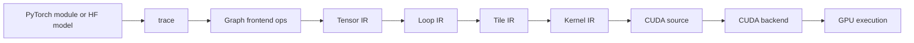

Useful compiler switches:

- `--ir torch|tensor|loop|tile|kernel|cuda` prints a chosen stage.
- `--dump-dir DIR` writes intermediate graphs, CUDA, and reproducers.
- `DEPLODOCK_DUMP_DIR=DIR` makes dumps automatic across compiler commands.
- `DEPLODOCK_NVCC_FLAGS="-Xcicc -O1"` speeds up correctness tests that compile many kernels.

### Benchmark Recipes

Start here when comparing model, engine, GPU, or concurrency choices.

```bash
deplodock bench recipes/*
deplodock bench recipes/* --filter "deploy.gpu=*5090*"
deplodock bench recipes/* --local
deplodock bench recipes/* --ssh user@host1 --ssh user@host2
```

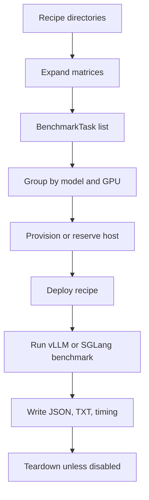

Benchmark output is written under each recipe's timestamped run directory or under configured result locations. Each
task writes human-readable text, structured JSON, timing data, and system information.

### Deploy A Recipe

Start here when validating an endpoint or changing provisioning/deployment behavior.

```bash
deplodock deploy local --recipe recipes/Qwen3-Coder-30B-A3B-Instruct-AWQ
deplodock deploy ssh --recipe recipes/GLM-5.1-FP8 --ssh user@host
deplodock deploy cloud --recipe recipes/GLM-5.1-FP8 --gpu "NVIDIA H200 141GB" --gpu-count 8
```

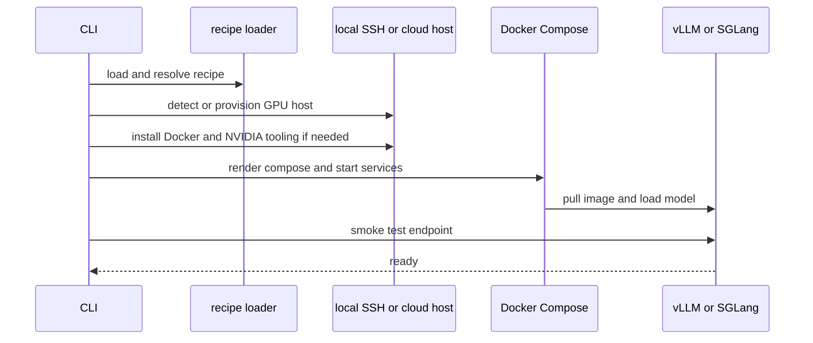

Use `--dry-run` to inspect generated commands and `--teardown` to stop a deployed recipe.

### Serve Compiled Embeddings

The `serve` workflow keeps vLLM's API, tokenizer, scheduler, and pooling behavior while replacing the embedding trunk
with Deplodock-compiled kernels.

```bash
deplodock serve Qwen/Qwen3-Embedding-0.6B
deplodock serve Qwen/Qwen3-Embedding-0.6B --bench --random-input-len 32
deplodock serve Qwen/Qwen3-Embedding-0.6B --bench --random-input-len 32 --stock
```

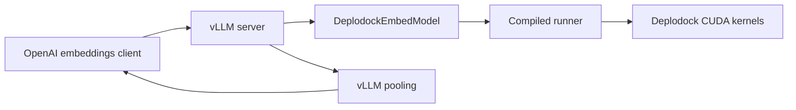

## Recipes In One Picture

Recipes are YAML files that describe a model, an engine, benchmark settings, and a matrix of hardware or config
variants. Matrix entries are deep-merged into the base recipe.

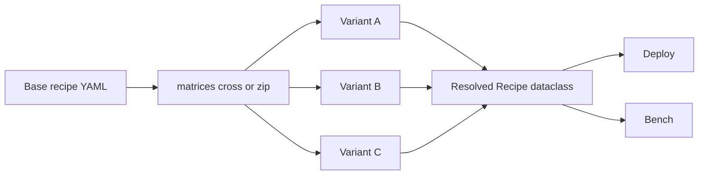

A minimal inference recipe looks like this:

```yaml
model:
  huggingface: "org/model-name"

engine:
  llm:
    tensor_parallel_size: 1
    context_length: 4096
    vllm:
      image: "vllm/vllm-openai:v0.22.1"
      extra_args: "--kv-cache-dtype fp8"

benchmark:
  max_concurrency: 16
  num_prompts: 64
  random_input_len: 512
  random_output_len: 128

matrices:
  deploy.gpu: "NVIDIA GeForce RTX 5090"
  deploy.gpu_count: 1
```

Important recipe ideas:

- `model.task: embed` switches smoke tests and benchmarks to `/v1/embeddings`.
- `engine.llm` contains engine-neutral fields such as `tensor_parallel_size`, `context_length`, and
  `max_concurrent_requests`.
- `engine.llm.vllm.extra_args` or `engine.llm.sglang.extra_args` is the escape hatch for engine-specific flags.
- `matrices.cross` creates a Cartesian product; `matrices.zip` moves several fields together.
- `--filter KEY=PATTERN` narrows expanded variants before execution.

## Where To Change Things

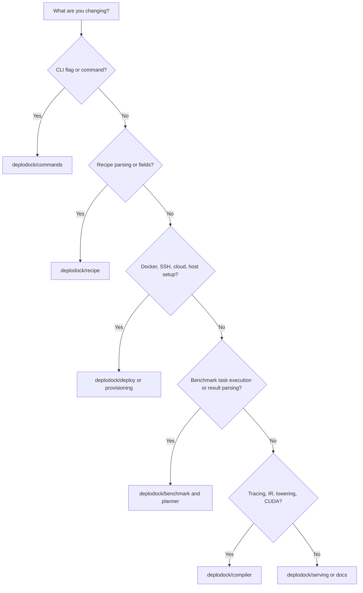

| Area | Start here | What belongs there |
|---|---|---|
| CLI flags and command handlers | `deplodock/commands/` | Argument parsing, help text, thin delegation |
| Recipes | `deplodock/recipe/` | YAML loading, matrix expansion, dataclass validation, engine flag mapping |
| Deployment | `deplodock/deploy/` | Compose generation, deploy orchestration, teardown |
| Provisioning | `deplodock/provisioning/` | SSH, remote setup, GCP, CloudRift, VM lifecycle |
| Benchmarking | `deplodock/benchmark/`, `deplodock/planner/` | Task enumeration, grouping, workloads, result parsing |
| Compiler IR and passes | `deplodock/compiler/` | Trace, graph rewrites, lowering, CUDA backend, tuning |
| vLLM plugin serving | `deplodock/serving/` | Embedding and generation model classes, runners, sampling |
| Tests | `tests/` | Unit, CLI, compiler, backend, and selected GPU/perf coverage |

## Compiler Mental Model

You do not need to understand every CUDA lowering rule to make progress. Keep these invariants in your head:

- A `Graph` is the shared container across dialects.
- Rewrite passes replace node ops in place rather than building a separate program type.
- One `LoopOp` becomes one kernel.
- Shapes live on `node.output.shape`; symbolic dimensions use `Dim`.
- Provenance follows frontend ops through decomposition, fusion, and lowering so generated kernels can be traced back to
  original PyTorch operations.
- Backends are the hardware boundary. Earlier compiler layers should stay free of CUDA imports.

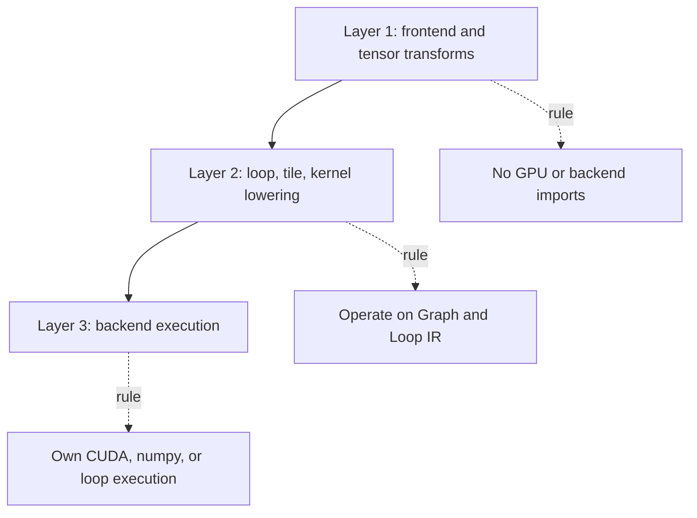

When debugging compiler behavior, start with the smallest snippet that reproduces the issue, print the IR stage just
before the surprising behavior, and only then look at the lowering pass.

## Common First Changes

### Add A CLI Flag

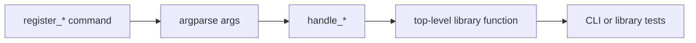

Put parsing in `deplodock/commands/...`, but keep reusable logic in the relevant library package. If the flag represents
a `DEPLODOCK_*` config value, route it through `deplodock/config.py` so CLI and programmatic callers share precedence.

### Add A Recipe Field

Update the dataclasses in `deplodock/recipe/types.py`, validation and loading in `deplodock/recipe/recipe.py`, and engine
flag mapping in `deplodock/recipe/engines.py` if the field maps to vLLM or SGLang. Add tests around matrix deep-merge and
validation behavior.

### Change Deployment Behavior

Deployment is split by responsibility:

- `deploy/compose.py` renders Docker Compose and nginx config.
- `deploy/orchestrate.py` owns high-level deploy, smoke test, timing, and teardown flow.
- `provisioning/remote.py` installs remote prerequisites.
- `provisioning/cloud.py`, `gcp.py`, and `cloudrift.py` own VM creation and deletion.

### Change Benchmark Results

Look at `benchmark/workload.py` for the command that runs the workload, `benchmark/results.py` for parsers and structured
output, and `commands/bench/__init__.py` for summary tables.

### Change Compiler Lowering

Find the dialect and pass that owns the transition you care about:

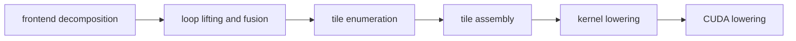

Favor narrow tests near the layer you are changing. For graph rewrites, unit tests often live under
`tests/compiler/passes/`; for backend behavior, start under `tests/compiler/backend/`.

## Debugging Tools

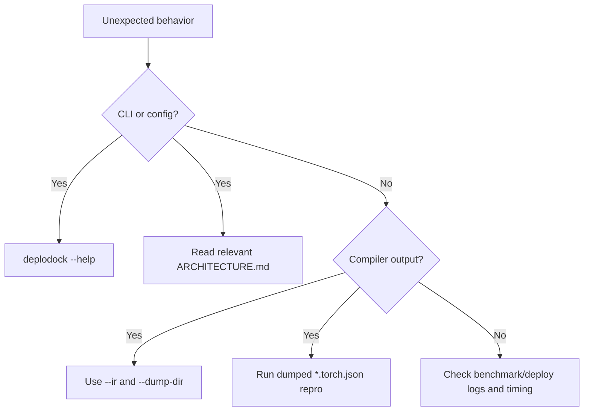

Useful commands:

```bash
# Print a single compiler stage
deplodock compile -c "nn.RMSNorm(2048)(torch.randn(1,32,2048))" --ir loop

# Dump compiler artifacts
DEPLODOCK_DUMP_DIR=/tmp/deplodock-dump deplodock run --bench -c "nn.RMSNorm(2048)(torch.randn(1,32,2048))"

# Re-run a dumped per-kernel torch reproducer
deplodock run --ir /tmp/deplodock-dump/k_rms_norm.torch.json --bench

# Compare two dump directories
deplodock compare /tmp/before /tmp/after
```

## Testing Strategy

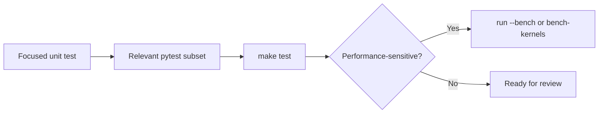

Common test commands:

```bash
make lint
make test
./venv/bin/pytest tests/compiler/passes/test_matmul_rules.py -v
./venv/bin/pytest tests/compiler/ -p no:randomly -n auto --dist=loadgroup
```

`make test` sets `DEPLODOCK_NVCC_FLAGS="-Xcicc -O1"` because the correctness suite is compile-bound. If you are checking
deployable kernel performance, re-bench at the default `-O3` path with `deplodock run --bench`, `deplodock tune --bench`,
or the perf test lane.

## Reading Map

For a deeper pass, read these in order:

1. `README.md` for examples and the public surface.
2. `deplodock/commands/ARCHITECTURE.md` for CLI, deploy, bench, timing, and command ownership.
3. `deplodock/recipe/ARCHITECTURE.md` for recipe and matrix behavior.
4. `deplodock/compiler/ARCHITECTURE.md` for the compiler stack and invariants.
5. `deplodock/serving/ARCHITECTURE.md` for vLLM plugin integration.
6. Child `ARCHITECTURE.md` files in the subsystem you are editing.

## First Useful PR Ideas

Good starter work is narrow and observable:

- Improve or add a recipe validation error.
- Add a CLI test around an existing flag.
- Document a missing recipe pattern.
- Add parsing coverage for a benchmark output variant.
- Add a focused compiler pass test for an existing invariant.
- Make a deploy dry-run message clearer.

Avoid starting with broad refactors. The repo has several long-running workflows where small ownership boundaries matter:
CLI should stay thin, recipe semantics should stay typed, deployment should remain reusable outside the CLI, and compiler
passes should preserve graph invariants stage by stage.
